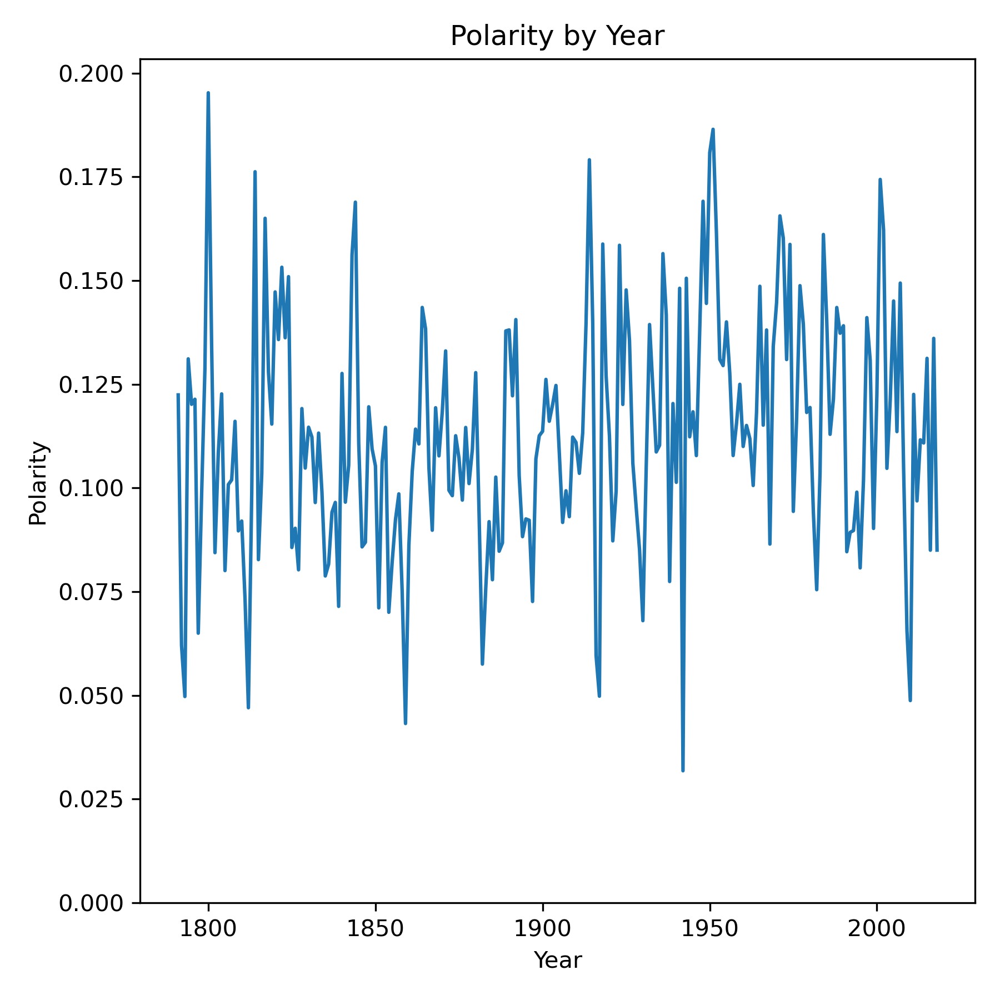

(don't worry, this is my only wordcloud!)

# MSDS692
Presidential Sentiment Analysis

by

Jeremy Beard

## Table of Contents

[Main Ideas](#mainideas)

[Methods](#methods)

[Results](#results)

[Conclusions](#conclusions)

[Future Work](#future)

[References](#references)

<a name="mainideas"/>

## Main Ideas
This project is centered around a dataset which contains speeches from the State of the Union of all presidents since George Washington! 

The project will utilize a variety of natural language processing techniques in order to answer questions that have been created surrounding the dataset. Sentiment analysis will be utilized, general word commonality will be explored and word frequency will be analyzed. The final output will be a visualization comparing all the presidents to each other within the lens of the State of the Union.

<a name="methods"/>

## Methods

This project will seek to explore the State of the Union of each of the presidents! To get started, I wanted to formulate a list of questions that would guide me throughout my work on this State of the Union dataset. After some thinking, I main questions I set out to answer were:

- What is the quantitative positive/negative sentiment between all the speeches?
- Which presidents use the widest variety of words?
- What is the quantitative positive/negative sentiment between all the presidents?
- What are the themes or buzzwords among the different speeches / presidents?
- What were the most common words used in each speech?
- Which presidents gave the longest speeches?
- Which presidents gave the shortest speeches?
- Which presidents used the most unique words?
- Which presidents used the least unique words?

And more! There was a lot to do. I referenced my old homework assignments heavily as well as found some new methods of analysis. In the past, I had used a specific text file for sentiment analysis. This text file was the key for each word's sentiment value. I utilized this method during my analysis. I ALSO utilized the TextBlob package and performed sentiment analysis this way. TextBlob was a new package for me and took some configuring, but ended up providing "polarity" and "subjectivity" scores that were extremely useful to add to my analysis.

These questions will be answered through the analysis that is conducted which involves the following:

- Make everything lowercase (of course)
- Remove all symbols and characters from the speech
- Remove stopwords from each speech
- Perform lemmatization on each speech
- Consolidate speeches by president for per-president analyses

<a name="results"/>

## Results

For my results, I created a LOT of charts. I answered a LOT of questions. I definitely answered all the questions I set out to answer and more. All in all, I created about 611 charts throughout my scripting. Let's say that again. 611 CHARTS. 

For my analysis, I analyzed the most frequent 1-word, 2-word, and 3-word phrases uttered by each president, as well as during each individual year. This alone resulted in 580 of the 611 charts, about 95%. This gave insight into what each individual president was addressing in their speech at the time, as well as the overall subjects addressed during each president's cumulative speeches. 

Aside from the common 1/2/3-word phrases, I performed sentiment analysis using two different methods: one, using a text file of sentiment keys I gained during my studies at Regis University, and another, using the TextBlob python package. Some important charts are as follows:

# Measuring Vocabulary / Amount of Unique Words per Speech

# Sentiment / Polarity / Subjectivity Measures

<a name="conclusions"/>

## Conclusions

All in all, it seems like there really isn't a great correlation for presidential sentiment. However, year 6 seemed to be the golden time for a president as the sentiment and polarity both spiked upwards during those years while remaining relatively consistent during the other years. Year 6 appears to be a bit of a "victory lap" in the president's State of the Union address, noticeably more positive than the other years.

With regard to other measures like word count, common n-grams, speech substance, and more, it was really interesting to see each presidents' focus areas. 

<a name="future"/>

## Future Work

This project was a huge learning experience for me and really it gave me a lot of ideas for the next capstone course I be attending! I realized some pitfalls pretty quickly near the end of the project that I want to improve upon in the next capstone. I started to even think the dataset I was using wasn't great for text analytics within a political lens. What I mean is, the State of the Union address is often a formal and well-regulated speech. The differences in speech between different presidents are probably not as noticeable in the State of the Union due to its traditional and formal nature. In the future, I would love to source a different, more informal source of presidential speech. In addition to that, the other pitfalls I noticed can be found below. 

I realized that my current project:

- Doesn't involve a significant amount of machine learning 
- Is not too interactive
- Doesn't have a great business case

In the future, I'd like to improve upon all of these items. For my next capstone, I'm planning on making sure the following components are included in the project:

- I want to work with NUMERICAL data, after all the text analysis here
- I want to make sure specific business questions are being addressed. This current project is more exploratory and was undergone out of historical significance

Given all this, I have a lot to take forward for the future. This project was fun and interesting, but a lot could be improved upon in the next iteration. 

<a name="references"/>

## References
The dataset I used was located at: 
https://www.kaggle.com/datasets/rtatman/state-of-the-union-corpus-1989-2017

I also utilized all of my old text-based homework assignments for text cleaning and sentiment analysis actions.

Aside from that, I utilized www.phind.com for unimportant technical questions where I couldn't remember specific syntax of certain operations. 

