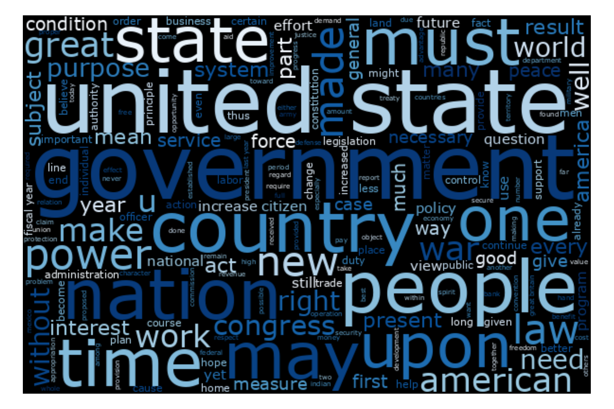
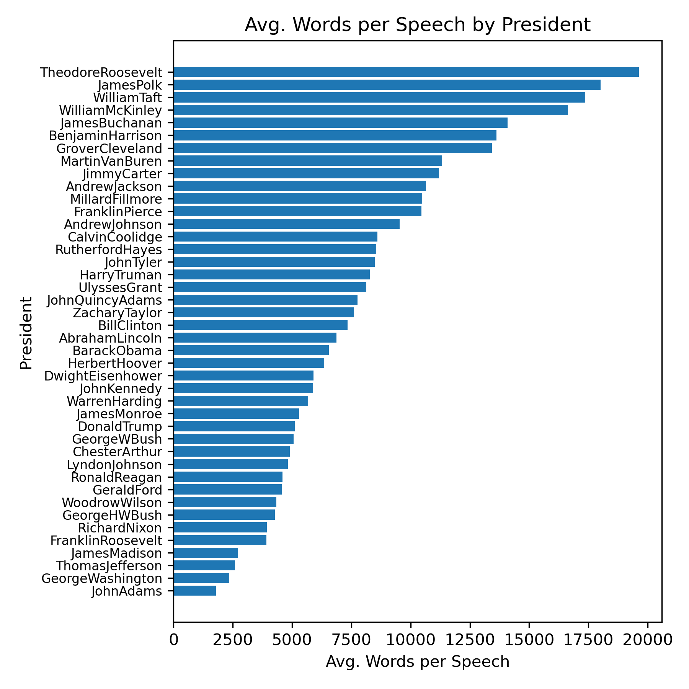
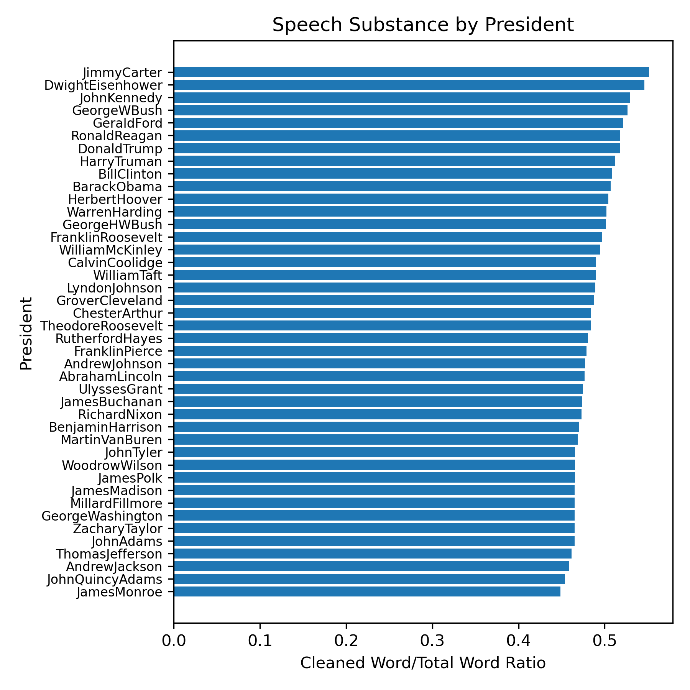
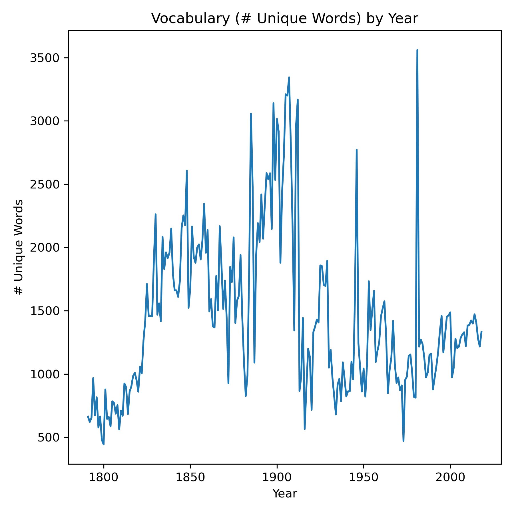
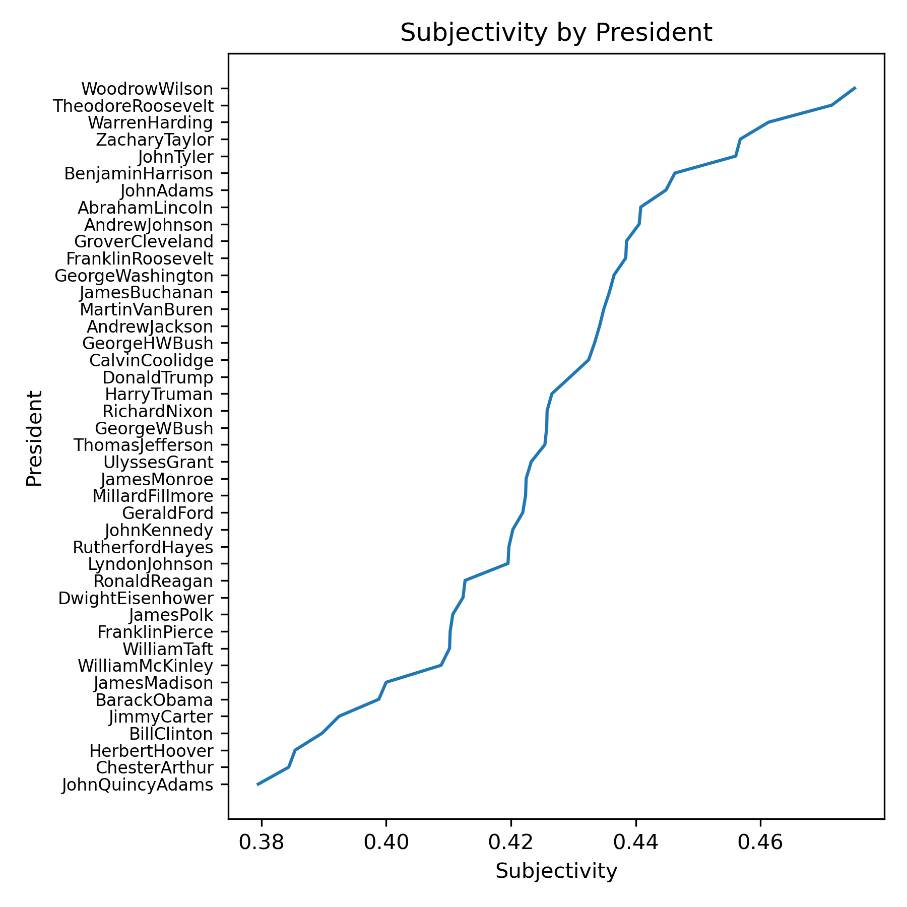
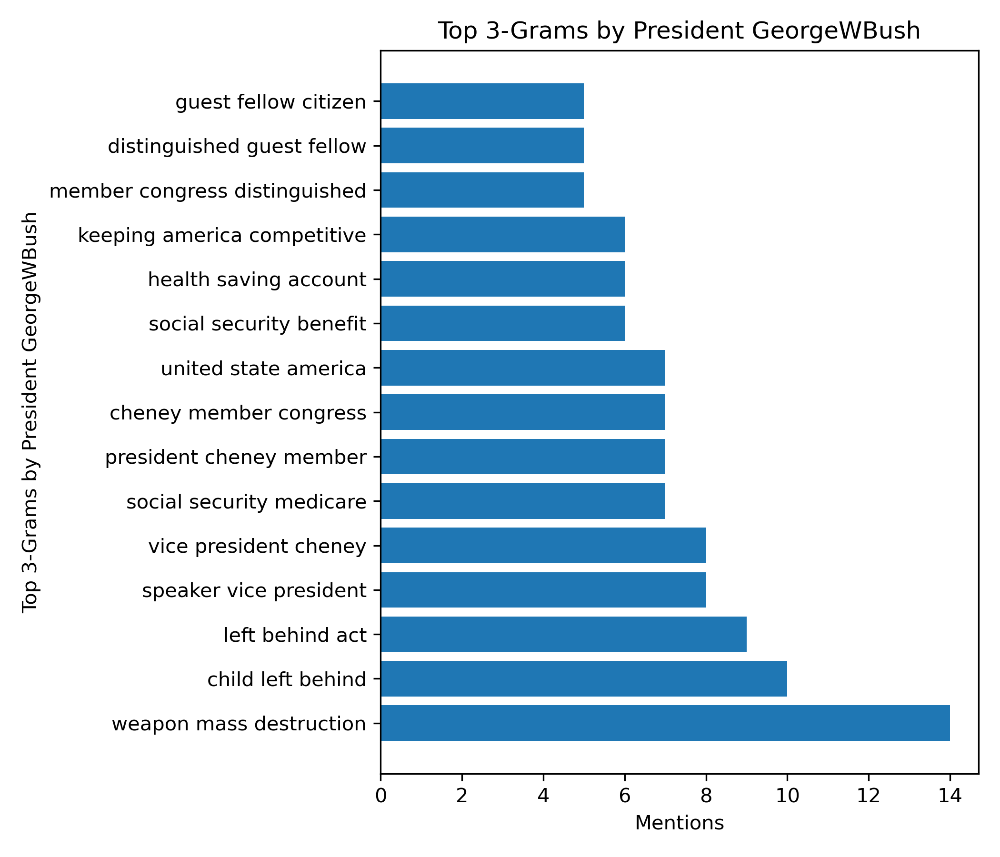

(don't worry, this is my only wordcloud!)

# MSDS692

**Presidential Sentiment Analysis**

by

Jeremy Beard

# Table of Contents

[Main Ideas](#mainideas)

[Methods](#methods)

[Results](#results)

[Conclusions](#conclusions)

[Future Work](#future)

[References](#references)

<a name="mainideas"/>

# Main Ideas
This project is centered around a dataset which contains speeches from the State of the Union of all presidents since George Washington! 

The project will utilize a variety of natural language processing techniques in order to answer questions that have been created surrounding the dataset. Sentiment analysis will be utilized, general word commonality will be explored and word frequency will be analyzed. The final output will be a visualization comparing all the presidents to each other within the lens of the State of the Union.

<a name="methods"/>

# Methods

This project will seek to explore the State of the Union of each of the presidents! To get started, I wanted to formulate a list of questions that would guide me throughout my work on this State of the Union dataset. After some thinking, the main questions I set out to answer were:

- What is the quantitative positive/negative sentiment between all the speeches?
- Which presidents use the widest variety of words?
- What is the quantitative positive/negative sentiment between all the presidents?
- What are the themes or buzzwords among the different speeches / presidents?
- What were the most common words used in each speech?
- Which presidents gave the longest speeches?
- Which presidents gave the shortest speeches?
- Which presidents used the most unique words?
- Which presidents used the least unique words?

And more! There was a lot to do. I referenced my old homework assignments heavily as well as found some new methods of analysis. In the past, I had used a specific text file for sentiment analysis. This text file was the key for each word's sentiment value and was used to map the words to their sentiment values. I utilized this method during my analysis. I ALSO utilized the TextBlob package and performed sentiment analysis this way. TextBlob was a new package for me and took some configuring, but ended up providing "polarity" and "subjectivity" scores that were extremely useful to add to my analysis.

'Sentiment' was gained from the text file key, mentioned in the paragraph above. It gives a measure, from -1.0 to +1.0, of each section of text. 'Polarity' was gained from the TextBlob package and also provided a similar measure, a measure from -1.0 to +1.0 of the positivity of a block of text. 'Subjectivity' was provided from the TextBlob package and was a measure from 0.0 to 1.0 of the block of text's level of opinion vs. factual speech. Subjectivity was included in the charts for analysis but was not focused on. 

Anyway, the questions mentioned above helped to focus my analysis and provide for a roadmap. Following that, I did a lot of data cleaning and organization which involved the following:

- Make everything lowercase (of course)
- Remove all symbols and characters from the speech
- Remove stopwords from each speech
- Perform lemmatization on each speech
- Consolidate speeches by president for per-president analyses

This data cleaning worked out really well. I ended up with two main dataframes in my script: one which was organized by year and by speech, and another which was organized by president and contained all the text of the specific president. Let's move on to see the results!

<a name="results"/>

# Results

For my results, I created a LOT of charts. I answered a LOT of questions. I definitely answered all the questions I set out to answer and more. All in all, I created about 611 charts throughout my scripting. Let's say that again. 612 CHARTS. Go click through the 'output' directory of my repo and see for yourself! Pick your favorite president :)

For my analysis, I analyzed the most frequent 1-word, 2-word, and 3-word phrases uttered by each president, as well as during each individual year. This alone resulted in 580 of the 611 charts, about 95%. This gave insight into what each individual president was addressing in their speech at the time, as well as the overall subjects addressed during each president's cumulative speeches. 

Aside from the common 1/2/3-word phrases, I performed sentiment analysis using two different methods: one, using a text file of sentiment keys I gained during my studies at Regis University, and another, using the TextBlob python package. Some important charts are as follows:

## Measuring Word Count 

## Measuring Speech Substance

I measured speech "substance" by taking a ratio of the word count AFTER cleaning / the word count BEFORE cleaning. Since cleaning removes the stopwords and filler material, this ratio will give a good measure of how much "fluff" was in the president's speech. 

## Measuring Vocabulary / Amount of Unique Words per Speech

I wanted to see which presidents used more of a variety of words. The two charts below serve to show the amount of unique words used by each president, or by each year. From the charts below, it looks like the early presidents did **not** use a lot of unique words. Reagan, Obama, W. Bush, and Clinton also did not use a lot of different words in their speeches, compared to others.

## Sentiment / Polarity / Subjectivity Measures

My main analytical focus was that of sentiment analysis for this project. There is not much business case for analyzing a dataset containing State of the Union speeches, but there can still be a whole lot of information gained from analysis on it! I utilized 'sentiment' as well as 'polarity' and 'subjectivity' to analyze the feeling of each speech. Explanations of each of these measures can be found in the 'Methods' section above but below are a few charts which give some insight into the sentiment, polarity, and subjectivity, of each president throughout the years. 

## 1-gram / 2-gram / 3-gram Charts of Interest

I found that the 2-gram charts were really the "sweet spot" in terms of useful information. 1-gram charts (or, the common word charts) didn't really give much information, and 3-gram charts were more general and less specific than the 2-gram charts. I included a few of the 2-gram and 3-gram charts below. For a complete list of all the 1-gram/2-gram/3-gram charts, please see the 'output' folder of my project. 

<a name="conclusions"/>

# Conclusions

All in all, it seems like there really isn't a great correlation for presidential sentiment. However, year 6 seemed to be the golden time for a president as the sentiment and polarity both spiked upwards during those years while remaining relatively consistent during the other years. Year 6 appears to be a bit of a "victory lap" in the president's State of the Union address, noticeably more positive than the other years. Nixon seemed to give short, positive State of the Union addresses, while Washington and the other founders gave short but more neutral speeches, with more fluff added in. Republican presidents of recent years had more positive speeches than Democratic presidents. 

With regard to other measures like word count, common n-grams, speech substance, and more, it was really interesting to see each presidents' focus areas. The final answers to my questions were:

- What is the quantitative positive/negative sentiment between all the speeches?

It seemed like the speeches were generally on the positive side, with sentiment and polarity scores above 0 most of the time. The lowest level of sentiment/polarity was around the period of World War II, around 1940-45. Following that period, there was a noticeable uptick in sentiment/polarity until the late 90's. 

- What is the quantitative positive/negative sentiment between all the presidents?

The sentiment can be shown in the 'Polarity by President' chart. It seems like Richard Nixon on average is the most positively speaking president! George W. Bush was the most recent president whose sentiment was more positive than most. Barack Obama was the most recent president whose sentiment was more negative than most. It also seemed like, on average, recent Republican presidents were shown to have a more positive sentiment than recent Democratic presidents. Presidents like Donald Trump, George W. Bush, Ronald Reagan, and Richard Nixon all had higher sentiment and polarity scores than presidents like Barack Obama and Bill Clinton.

- Which presidents use the widest variety of words?

It seemed like, on average, Zachary Taylor, William McKinley, William Howard Taft, Millard Fillmore, James Polk, and John F Kennedy had the highest variety of words among the presidents.

It also seemed like the early presidents had the lowest number of unique words. Presidents like Washington, John Adams, Thomas Jefferson, and James Madison all scored the lowest on the measure of vocabulary. 

- What are the themes or buzzwords among the different speeches / presidents?

The 2-gram and 3-gram charts can be investigated to see the different themes or buzzwords among the different speeches and presidents. It is interesting to browse through all of them! For example, George W Bush's 2-gram chart shows popular mentions like "middle east", "saddam hussein", "war terror", and "weapon mass", showing how important the War on Terror was to his presidency. Franklin Roosevelt presided over the nation during World War II and his 2-gram chart definitely reflects this, showing terms like "armed force", "world war", and "united nation". 

- What were the most common words used in each speech?

Similar answer as above :) the 1-word, 2-gram, and 3-gram charts all show the most common words and phrases used during each of the speeches. 

- Which presidents gave the longest speeches?

On average, Theodore Roosevelt gave the longest speeches. James Polk, William Howard Taft, and William McKinley were all contenders as well.

- Which presidents gave the shortest speeches?

The earlier presidents seemed to give shorter speeches. Presidents like George Washington, John Adamas, James Madison, and Thomas Jefferson all ranked low on word count. 

- Which presidents used the most unique words?

Similar answer to the vocabulary / variety of word measure, shown above.

- Which presidents used the least unique words?

Similar answer to the vocabulary / variety of word measure, shown above.

<a name="future"/>

# Future Work

This project was a huge learning experience for me and really it gave me a lot of ideas for the next capstone course! I realized some pitfalls pretty quickly near the end of the project that I want to improve upon in the next capstone. I started to even think the dataset I was using wasn't great for text analytics within a political lens. What I mean is, the State of the Union address is often a formal and well-regulated speech. The differences in speech between different presidents are probably not as noticeable in the State of the Union due to its traditional and formal nature. In the future, I would love to source a different, more informal source of presidential speech. In addition to that, the other pitfalls I noticed can be found below. 

I realized that my current project:

- Doesn't involve a significant amount of machine learning 
- Is not too interactive
- Doesn't have a great business case

In the future, I'd like to improve upon all of these items. For my next capstone, I'm planning on making sure the following components are included in the project:

- I want to work with NUMERICAL data, after all the text analysis here
- I want to make sure specific business questions are being addressed. This current project is more exploratory and was undergone out of historical significance

Given all this, I have a lot to take forward for the future. This project was fun and interesting, but a lot could be improved upon in the next iteration.

Thank you!

Jeremy Beard 

<a name="references"/>

# References

Please see my PowerPoint Presentation for proper APA citations of all my resources.

The dataset I used was located at: 
https://www.kaggle.com/datasets/rtatman/state-of-the-union-corpus-1989-2017

I also utilized all of my old text-based homework assignments for text cleaning and sentiment analysis actions.

Aside from that, I utilized www.phind.com for unimportant technical questions where I couldn't remember specific syntax of certain operations. I also heavily referenced the matplotlib documentation for assistance with visualization items. 

